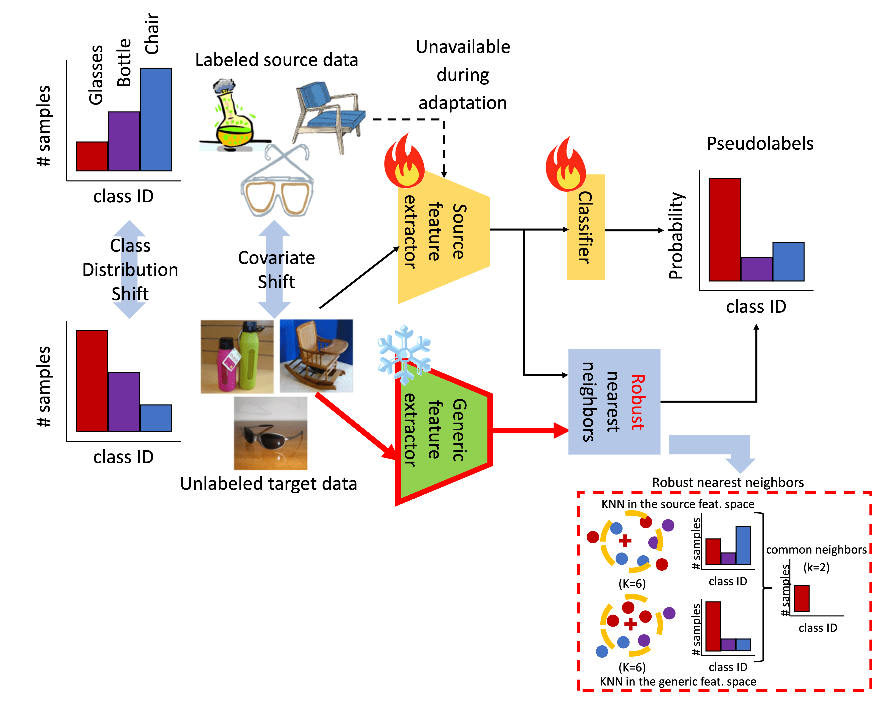

# Introduction

This repository contains the official implementation of the paper "Robust Nearest Neighbors for Source-Free Domain Adaptation under Class Distribution Shift". 

## Abstract

The goal of source-free domain adaptation (SFDA) is retraining a model fit on data from a source domain (e.g. drawings) to classify data from a target domain (e.g. photos) employing only the target samples. In addition to the domain shift, in a realistic scenario, the number of samples per class on source and target would also differ (i.e. class distribution shift, or CDS). Dealing label-less with CDS via target data only is challenging, and thus previous methods assume no class imbalance in the source data. We study the SFDA pipeline and, for the first time, propose a SFDA method that can deal with class imbalance in both source and target data. While pseudolabeling is the core technique in SFDA to estimate the distribution of the target data, it relies on nearest neighbors, which makes it sensitive to CDSs. We are able to calculate robust nearest neighbors by leveraging additional generic features free of the source model’s CDS bias. This provides a “second-opinion” regarding which nearest neighbors are more suitable for adaptation. We evaluate our method using various types of features, datasets and tasks, outperforming previous methods in SFDA under CDS.

## Overview



Our method takes a model (i.e., ResNet) trained on the source data and adapts it to a target data with class distribution shift (without accessing the target data or its labels).

- Inputs: Source model, target data
- Outputs: Predictions of the target data and accuracy of the system

# Implementation

This code is based on the pseudolabeling-based source-free domain adaptation pipeline of the CVPR2023 paper:

"Guiding Pseudo-labels with Uncertainty Estimation for Source-free Unsupervised Domain Adaptation" - Mattia Litrico, Alessio Del Bue, Pietro Morerio.

https://github.com/MattiaLitrico/Guiding-Pseudo-labels-with-Uncertainty-Estimation-for-Source-free-Unsupervised-Domain-Adaptation

## Requirements

In order to run it, you need to install the following 
- pyenv (version 2.4.13) to install - python (version 3.8.0)
- poetry (version 1.8.3)

You can install the library requirements via the command "poetry install --no-root":

- torch = "2.0.0"
- torchvision = "0.15.1"
- scikit-learn = "1.2.2"
- byol-pytorch = "^0.6.0"
- transformers = "^4.34.0"

## Datasets

The datasets used in the paper are as follows:

### VISDA-C

Downloaded from here (train and validation splits, not test since it has no labels): http://csr.bu.edu/ftp/visda17/clf/
- Some images in the target domain (real) are grayscale, so triplicating the channel dimension may be necessary.

### Office-Home

Downloaded from here: https://www.hemanthdv.org/officeHomeDataset.html

### DomainNet

Downloaded from here (cleaned version): http://ai.bu.edu/M3SDA/

### RSUT configuration files

The imbalanced version of the datasets is created via the configuration files from the repository of the paper "Imbalanced Source-free Domain Adaptation".
- Each domain has a train, validation (train-val) and test set, and all dataset combinations are evaluated. The source model is trained in the train split of the corresponding domain, and then adaptation and evaluation is performed on the test set of the target domain.
    - https://github.com/LeoXinhaoLee/Imbalanced-Source-free-Domain-Adaptation

Please locate these files under a common folder called 'Imbalanced'. The final directory tree should look as follows:
```
${DATA_ROOT}
├── VISDA
│   ├── train
│   └── validation
├── officeHome
│   ├── Art
│   ├── Clipart
│   ├── Product
│   └── Real_World
├── domainNet
│   ├── clipart
│   ├── painting
│   ├── real
│   └── sketch
└── Imbalanced
    ├── VISDA_RSUT
    │   ├── train_RS.txt
    │   ├── train_UT.txt
    │   ├── validation_RS.txt
    │   ├── validation_UT.txt
    │  ...
    ├── officeHome_RSUT
    │   ├── Clipart_RS.txt
    │   ├── Clipart_UT.txt
    │   ├── Product_RS.txt
    │   ├── Product_UT.txt
    │   ├── RealWorld_RS.txt
    │   ├── RealWorld_UT.txt
    │  ...
    └── domainNet_mini
        ├── clipart_test_mini.txt
        ├── clipart_train_mini_val.txt
        ├── clipart_train_mini.txt
        ├── painting_test_mini.txt
        ├── painting_train_mini_val.txt
        ├── painting_train_mini.txt
        ├── real_test_mini.txt
        ├── real_train_mini_val.txt
        ├── real_train_mini.txt
        ├── sketch_test_mini.txt
        ├── sketch_train_mini_val.txt
        ├── sketch_train_mini.txt
       ...
```

## How to run

In the commands below, replace the following variables by the desired values:
- ${DATA_ROOT}: Path to the folder where the datasets are stored (relative to the current directory)
- ${SRC_DOMAIN}: Name of the source domain (Product, painting, etc.)
- ${TGT_DOMAIN}: Name of the target domain (Product, painting, etc.)

Commands to train the source model:

- For VisDA-C

poetry run python train_source.py --data_dir ${DATA_ROOT} \
--dataset visdac/source --run_name visdac_source_imbalanced \
--num_epochs 100 --num_class 12 --lr 0.001 --batch_size 64

- For OfficeHome

poetry run python train_source.py --data_dir ${DATA_ROOT} \
--dataset officehome/${SRC_DOMAIN} --run_name officehome_${SRC_DOMAIN}_source_imbalanced \
--num_epochs 1000 --num_class 65 --lr 0.001 --batch_size 128

- For DomainNet

poetry run python train_source.py --data_dir ${DATA_ROOT} \
--dataset domainnet/${SRC_DOMAIN} --run_name domainnet_${SRC_DOMAIN}_source_mini \
--num_epochs 1000 --num_class 40 --lr 0.001 --batch_size 128

Commands to adapt the source model:

- For VisDA-C

poetry run python train_target_SwinT.py --data_dir ${DATA_ROOT} --dataset visdac/target \
--source visdac_source_imbalanced --run_name visdac_source2target_SwinT_imbalanced \
--num_class 12 --batch_size 64 --lr 0.01 \
--num_epochs 100 --num_neighbors 100 --num_near_neighbors 10

- For OfficeHome

poetry run python train_target_SwinT.py --data_dir ${DATA_ROOT} --dataset officehome/${TGT_DOMAIN} \
--source officehome_${SRC_DOMAIN}_source_imbalanced --run_name officehome_${SRC_DOMAIN}2${TGT_DOMAIN}_SwinT_imbalanced \
--num_class 65 --batch_size 128 --lr 0.001 \
--num_epochs 200 --num_neighbors 100 --num_near_neighbors 10

- For DomainNet

poetry run python train_target_SwinT.py --data_dir ${DATA_ROOT} --dataset domainnet/${TGT_DOMAIN} \
--source domainnet_${SRC_DOMAIN}_source_mini --run_name domainnet_${SRC_DOMAIN}2${TGT_DOMAIN}_SwinT_mini \
--num_class 40 --batch_size 128 --lr 0.001 \
--num_epochs 200 --num_neighbors 100 --num_near_neighbors 10

## Output files

The results of the domain adaptation are saved inside "logs", in a folder named as indicated in the option "--run_name". Along with the accuracies of training and validation, the predictions and ground truth labels are also saved in PKL format. In addition, the weights of the best model are also stored (best in the training data, best in the validation data, and best in the validation data class-wise).
